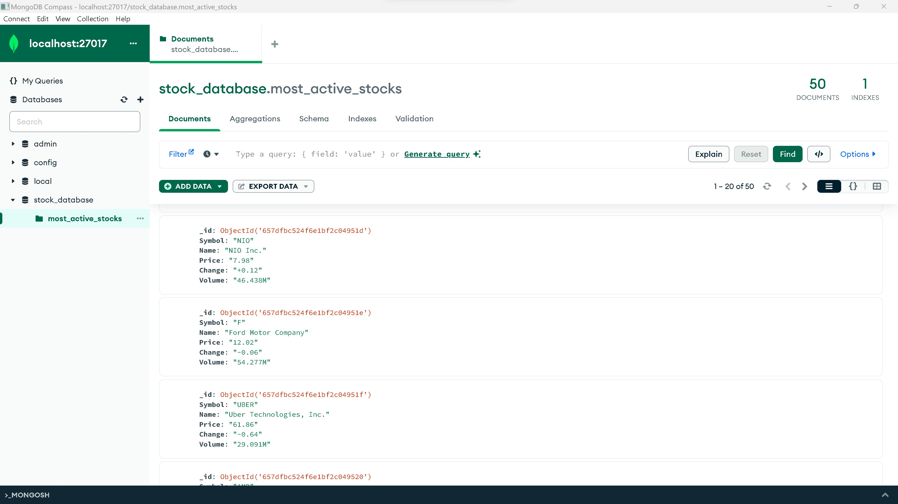
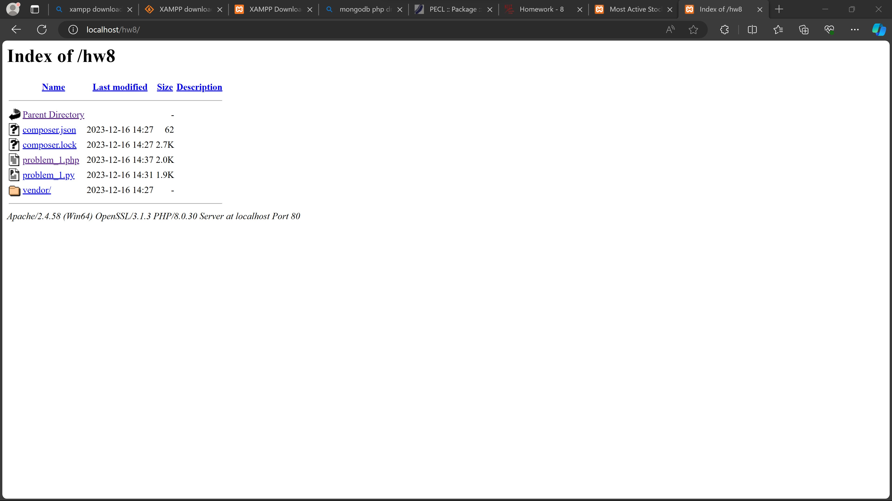
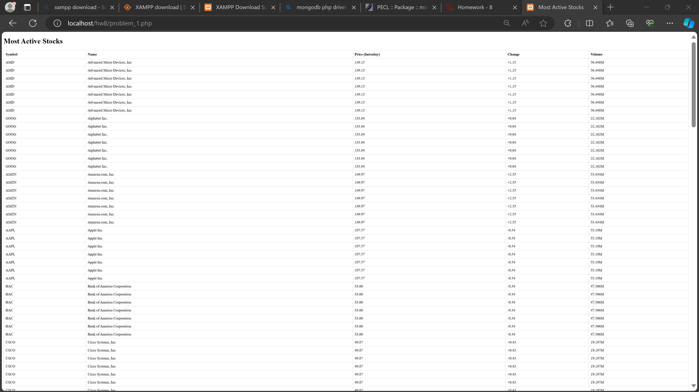
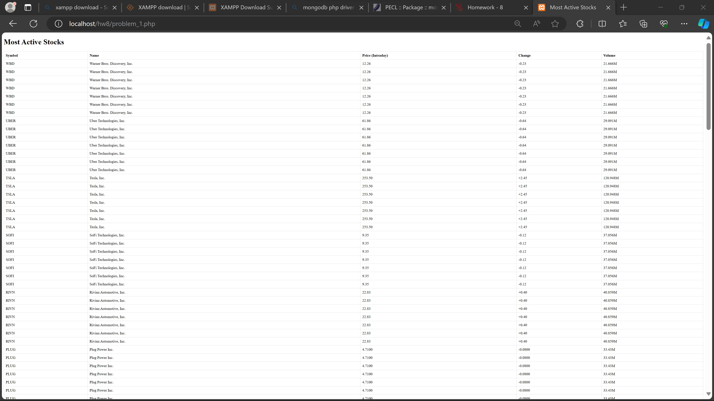

# 🏦 Real-Time NYSE Tracker

The **Real-Time NYSE Tracker** is a full-stack web application designed to **scrape, store, and display the most active stocks from the New York Stock Exchange (NYSE)** using Python, MongoDB, and PHP hosted on XAMPP.

This project demonstrates how real-time stock market data can be collected using APIs/web scraping, stored efficiently in a MongoDB database, and visualized dynamically through a simple web interface.

---

## 🚀 Features

- **Automated Data Scraping (Python):**
  - Uses Python scripts (`Problem1.py`, `scraper.py`) to fetch real-time NYSE stock data.
  - Extracts essential information like stock symbol, name, price, change, and volume.
  
- **Database Integration (MongoDB):**
  - Stores fetched data in a MongoDB collection called `most_active_stocks` under `stock_database`.
  - Data can be queried and updated dynamically.

- **Web Visualization (PHP + HTML + XAMPP):**
  - PHP scripts read MongoDB data and render it in a structured, easy-to-read HTML table.
  - Hosted locally using Apache through XAMPP.

- **Backend Connection Verification:**
  - All connections (Python ↔ MongoDB ↔ PHP) are tested for reliability and real-time updates.

---

## 🧠 Technologies Used

| Component | Technology |
|------------|-------------|
| **Backend** | Python (`requests`, `pymongo`, `beautifulsoup4`) |
| **Database** | MongoDB (Compass GUI for visualization) |
| **Frontend** | PHP, HTML, CSS |
| **Web Server** | Apache (XAMPP) |
| **Tools** | Windows, PowerShell, VS Code |

---

## ⚙️ Project Workflow

1. **Scraper Execution**  
   - Run the Python script to fetch live data.  
   - Data is parsed and inserted into MongoDB.

2. **Database Storage**  
   - Data stored in the `stock_database.most_active_stocks` collection.  
   - Viewable via MongoDB Compass for confirmation.

3. **Frontend Display**  
   - Open `http://localhost/real-time-nyse-tracker/problem_1.php` in a browser.  
   - The PHP script fetches and displays the stock list dynamically.

---

## 📸 Screenshots

### 1️⃣ MongoDB Compass — Stored Stock Data  
Shows how the data is structured inside MongoDB after the Python script inserts stock information such as **symbol**, **price**, **change**, and **volume**.  

  

---

### 2️⃣ XAMPP Directory — Project Files  
Displays the project folder structure hosted under Apache in XAMPP.  
It confirms that PHP, Python, and resource files are properly placed in the `htdocs` directory for execution.  

  

---

### 3️⃣ Web Output — Most Active Stocks (Part 1)  
This page dynamically retrieves and lists the most active NYSE stocks directly from MongoDB, displaying real-time data such as **price**, **change**, and **volume**.  

  

---

### 4️⃣ Web Output — Most Active Stocks (Part 2)  
Continuation of the data table showing additional stocks, confirming that the data integration between Python, MongoDB, and PHP is functioning correctly.  

  

---

## 🧩 Folder Structure

